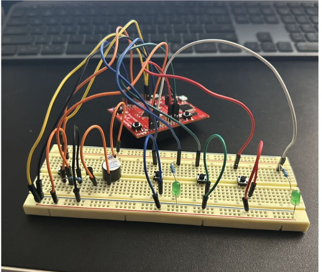

# Lab 2 Home Control System

## Circuit Diagram

## Pin Configuration

## Breadboard Picture

## Flowchart
- Main function

- Doorbell function

- Room Lighting Control function

- Stair Wall Lighting Control function

## Source Code

[-> Click Here](main.c)