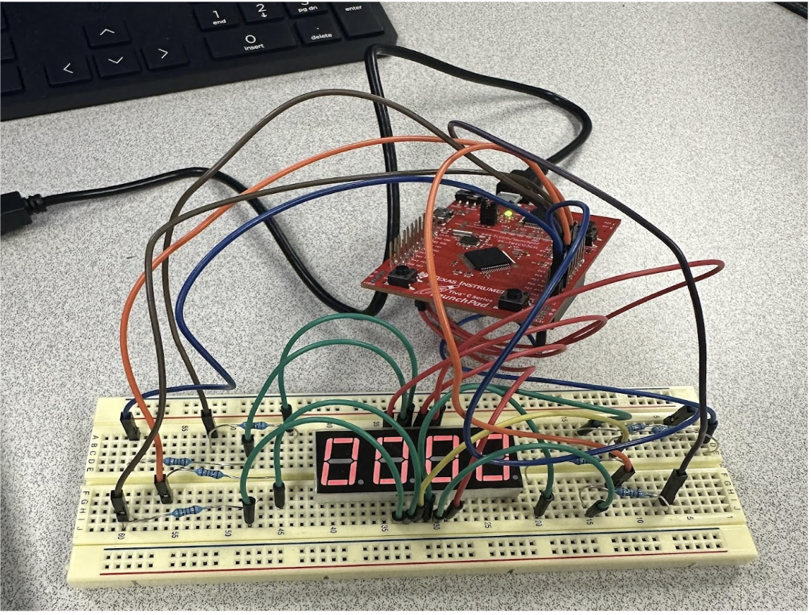

# Lab 3 - 4 Digit Seven - Segement Display

## Circuit Diagram

## Pin Configuration

## Breadboard Picture

## Flowchart
- Main function

- SegDisplay function

- CheckSW function

- Display7Seg function

- ToggelDp function

## Source Code

[-> Click Here](main.c)